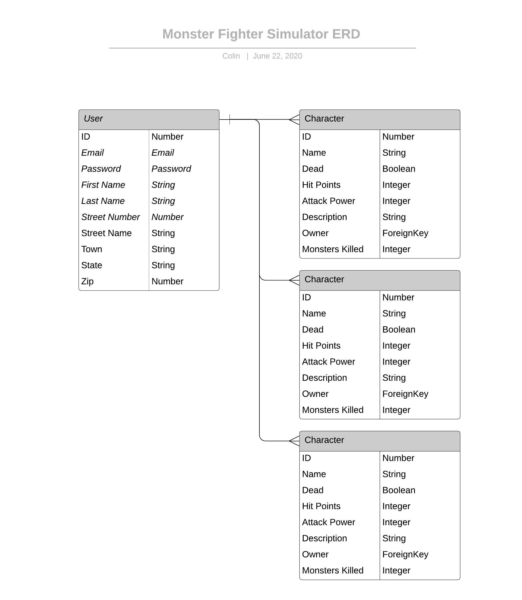

# Character Creation Tool API

This is the capstone project of my time at General Assembly. I wanted to push myself and really make use of all of the different tools that we had been taught. This is why I am incorporating a React front-end built with Javascript to a Django back-end built with Python (which incorporating those two together was a lot harder than I had initially realized).

This project is a simple character creation tool that also tracks if a character is alive or dead, and can revive them if they are dead. I wanted to create an application which I would want to use and be able to show to friends and have them enjoy it.

Working within the scope of time (4 days) there was a lot more which I had wished to accomplish and still may in later iterations of the project. Originally (and you will see in ERD/Wireframes below) I had wanted to flesh a full Monster Fighting Simulator. While this did not fully come to fruition the foundation is there to build from in the future.

## Important Links

- [Character Creation Tool Client Repo](https://github.com/brinecr/Monster-Fighting-Simulator-Client)
- [Deployed API](https://character-creation-tool.herokuapp.com/)
- [Deployed Client](https://brinecr.github.io/Character-Creation-Tool-Client/#/)

If you would like to take a look a the admin please use the superuser name of test@test.com and pw test.

- [Deployed API Admin](https://character-creation-tool.herokuapp.com/admin/)

## Planning Story

The first thing I took time to do was really figure out what I wanted to accomplish with this project.

I then put together a tentative schedule:

1. Monday: Back End Complete + Auth + as much documentation that I can
1. Tuesday: Front-End
1. Wednesday: Front-End (make sure front end is talking to back end properly)
1.Thursday: Make things pretty, clean things up (SCSS, CSS), add extra functionality (more monsters, other attributes to characters)

Quickly I learned that making Django work with the React template that I was using needed a bit of work. This really put me behind from the get-go and so I had to tailor the rest of the project accordingly.

What actually happened was more along the lines of:

1. Monday: Back End Complete
1. Tuesday: Front-End Auth - working on getting Auth completed
1. Wednesday: Front-End - Fleshing out character creation tools and making sure they spoke with the back end
1.Thursday: Cleaning up buttons and project overall, adding update functionality, completing readme and deployments

### Technologies Used

1. Django
1. Python3
1. Markup documentation
1. Cors
1. GitHub Integration w/ branch control
1. Heroku deployment
1. Use of Pipenv with Python 3
1. Wireframes
1. User Stories
1. ERD

### Unsolved Problems

I see this project as the base of a game where you can take these characters and their statistics and then do more with them.

Originally I had wanted to implement a monster fighting simulator as the program I was going for - but had to adjust my scope during the process so I decided to make it into a character creation tool with what I had already built. The idea behind the monster fighting element I would have been able to battle characters against pre-defined monsters (and maybe even let players define some in the future).

Taking these basic tools as a combat system I could also flesh out a world to have a character walk around - I like to think of the original Final Fantasy game as a lot of inspiration there as "what could be."

On the back-end specifically I could, in the future, add more functionality to tracking statistics. Things like height, weight, and individual attributes. This would have been a stretch goal but I wanted to keep it simple at first.

## Images

---
### ERD (entity relationship diagram)



## Instructions
Here's the instructions on how to use our API

> If TOKEN REQUIRED is set to Yes, please include this in your http request:
> ```
>   --header "Authorization: Token ${TOKEN}" \
> ```

**USER**
| PURPOSE | EXTENSION | VERB | TOKEN REQUIRED | RETURN OBJECT | RETURN STATUS |
| --- | --- | --- | --- | --- | --- |
| Sign Up | '/sign-up' | 'POST' | NO | User Object | 201 |
| Sign In | '/sign-in' | 'POST' | NO | User Object | 201 |
| Change Password | '/change-password' | 'PATCH' | YES | None | 204 |
| Change Username | '/change-username' | 'PATCH' | YES | User Object | 201 |
| Sign out | '/sign-out' | 'DELETE' | YES | None | 204 |

These are the data format for the api calls

*SIGN UP*
```javascript
{
  "credentials": {
    "email": <email>,
    "password": <password>,
    "password_confirmation": <password_confirmation>
  }
}
```

*SIGN IN*
```javascript
{
  "credentials": {
    "email": <email>,
    "password": <password>
  }
}
```

*CHANGE PASSWORD*
```javascript
{
  "passwords": {
    "old": <oldPassword>,
    "new": <newPassword>
  }
}
```

**PROFILE**
| PURPOSE | EXTENSION | VERB | TOKEN REQUIRED | RETURN OBJECT | RETURN STATUS |
| --- | --- | --- | --- | --- | --- |
| Create | 'characters/' | 'POST' | YES | Character Object | 201 |
| Read | 'characters/' | 'GET' | YES | Character Object | 200 |
| Update | 'characters/' + characterid | 'PATCH' | YES | Character Object | 204 |
| Delete | 'characters/' + characterid | 'DELETE' | YES | Character Object | 200 |

These are the api calls:

*CREATE*
```javascript
// Create character also has default fields for hit_points, dead, attack_power, and monsters_killed that do not need user input
{
  "character": {
    "name": <name>
    "description": <description>
  }
}

```

*UPDATE*
```javascript
// Heal Character happens on a button press, no other fields/input needed
{
  "character": {
    "hit_points": 10,
    "dead": false
    "name": <character name based on ID>
    "description": <character description based on ID>
  }
}

// Kill Character happens on a button press, no other fields/input needed
{
  "character": {
    "hit_points": 0,
    "dead": True,
    "name": <character name based on ID>
    "description": <character description based on ID>
  }
}
```

### Set Up and Installation Instructions

Please see Client instructions as well - both the back end API and Front End application need to be loaded and running for the front end to work. You can access the back end through the admin panel instructions at the top of this document.

If you choose to fork/clone this repo please follow these instructions to make sure it is working correctly:
1. Fork the Repository
2. Click clone the Repository
3. Open up your terminal and navigate to the location where you would like to clone the respository
4. Type `git clone` then copy/paste the link you received from cloning and press enter. This should install the cloned repository.
5. Enter into the repository by typing `CD Character-Creation-Tool-API` and pressing enter.
6. At this point you can create a new branch if you would like or continue on the master branch.
7. Run `pipenv shell` to start up your virtual environment.
8. Run `pipenv install` to install dependencies.
9. Open the repository in Atom with `atom .`
10. Create a psql database for your project
    1. Type `psql` to get into interactive shell.
    2. Run `CREATE DATABASE character-creation-tool;`
11. Create a `.env` file
    1. Add `ENV=development` to the first line of the .env file.
    2. Add `DB_NAME_DEV=character-creation-tool` to the second line of the file.
    3. Generate a secret key using [this tool](https://djecrety.ir) and add it to the `.env` file using the key `SECRET` so it looks like `SECRET=secret_key` on the 3rd line.
11. Type `python3 manage.py runserver` into the terminal to spin up the API. You should be able to visit it in a browser via http://localhost:8000/ though I recommend the admin link at the top of the document for more minute control.

See below documentation for how the .env file should look and additional python commands.

### The `.env` File

After following the steps above, your `.env` file should look _something_ like
the following, replacing `project_db_name` with your database name and `secret_key`.

```sh
ENV=development
DB_NAME_DEV=character-creation-tool
SECRET=secret_key
```

## Commands

Commands are run with the syntax `python3 manage.py <command>`:

| command | action |
|---------|--------|
| `runserver`  |  Run the server |
| `makemigrations`  | Generate migration files based on changes to models  |
| `migrate`  | Run migration files to migrate changes to db  |
| `startapp`  | Create a new app  |
