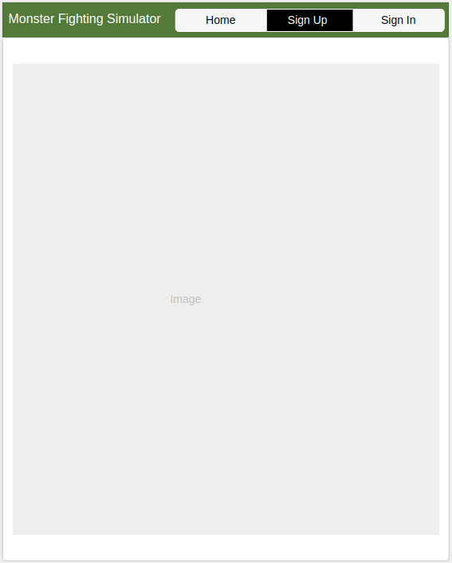
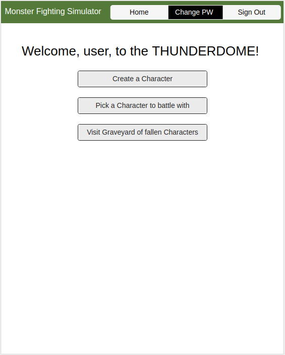
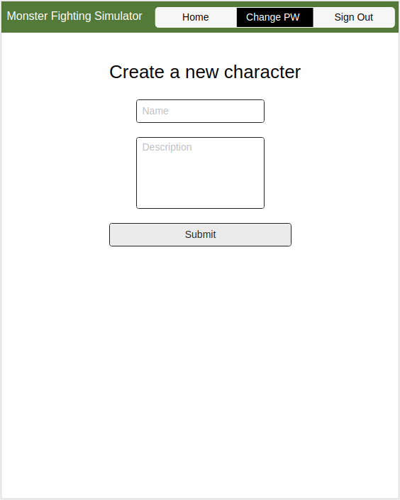
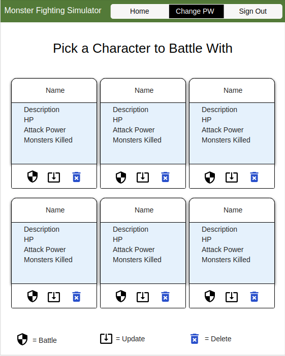
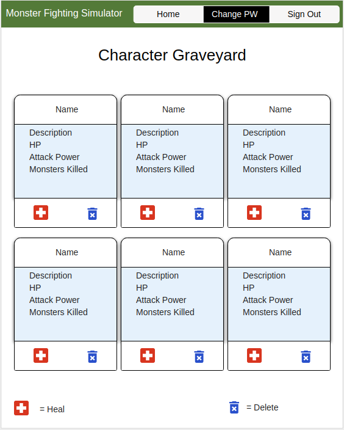

# Character Creation Tool API

This is the capstone project of my time at General Assembly. I wanted to push myself and really make use of all of the different tools that we had been taught. This is why I am incorporating a React front-end built with Javascript to a Django back-end built with Python (which incorporating those two together was a lot harder than I had initially realized).

This project is a simple character creation tool that also tracks if a character is alive or dead, and can revive them if they are dead. I wanted to create an application which I would want to use and be able to show to friends and have them enjoy it.

Working within the scope of time (4 days) there was a lot more which I had wished to accomplish and still may in later iterations of the project. Originally (and you will see in ERD/Wireframes below) I had wanted to flesh a full Monster Fighting Simulator. While this did not fully come to fruition the foundation is there to build from in the future.

## Important Links

- [Character Creation Tool Client Repo](https://github.com/brinecr/Monster-Fighting-Simulator-Client)
- [Deployed API](https://character-creation-tool.herokuapp.com/)
- [Deployed Client](https://brinecr.github.io/Character-Creation-Tool-Client/#/)

If you would like to take a look a the admin

- [Deployed API](https://character-creation-tool.herokuapp.com/admin)

## Planning Story

The first thing I took time to do was really figure out what I wanted to accomplish with this project.

I then put together a tentative schedule:

1. Monday: Back End Complete + Auth + as much documentation that I can
1. Tuesday: Front-End
1. Wednesday: Front-End (make sure front end is talking to back end properly)
1.Thursday: Make things pretty, clean things up (SCSS, CSS), add extra functionality (more monsters, other attributes to characters)

Quickly I learned that making Django work with the React template that I was using needed a bit of work. This really put me behind from the get-go and so I had to tailor the rest of the project accordingly.

What actually happened was more along the lines of:

1. Monday: Back End Complete
1. Tuesday: Front-End Auth - working on getting Auth completed
1. Wednesday: Front-End - Fleshing out character creation tools and making sure they spoke with the back end
1.Thursday: Cleaning up buttons and project overall, adding update functionality, completing readme and deployments

### User Stories

1. As an unregistered user i want to be able to sign up for an account.
1. As a user I would like to be able to create characters!
1. As a user I would like to make my characters battle monsters!
1. As a user I would love to see some power-ups available while battling monsters!
1. As a user I would love to track how well my characters have done!
1. As a user I would love to be able to revive my characters from the dead!
1. As a user I want to be able log into my account
1. As a user I want to be able to sign out
1. As a user I want to be able to change my password

### Technologies Used

1. Django
1. Python3
1. Markup documentation
1. Cors
1. GitHub Integration w/ branch control
1. Heroku deployment
1. Use of Pipenv with Python 3
1. Wireframes
1. User Stories
1. ERD

### Unsolved Problems

I see this project as the base of a game where you can take these characters and their statistics and then do more with them.

Originally I had wanted to implement a monster fighting simulator as the program I was going for - but had to adjust my scope during the process so I decided to make it into a character creation tool with what I had already built. The idea behind the monster fighting element I would have been able to battle characters against pre-defined monsters (and maybe even let players define some in the future).

Taking these basic tools as a combat system I could also flesh out a world to have a character walk around - I like to think of the original Final Fantasy game as a lot of inspiration there as "what could be."

On the back-end specifically I could, in the future, add more functionality to tracking statistics. Things like height, weight, and individual attributes. This would have been a stretch goal but I wanted to keep it simple at first. 

## Images

---
### ERD (entity relationship diagram)


#### Wireframe:







## Instructions
Here's the instructions on how to use our API

> If TOKEN REQUIRED is set to Yes, please include this in your http request:
> ```
>   --header "Authorization: Token ${TOKEN}" \
> ```

**USER**
| PURPOSE | EXTENSION | VERB | TOKEN REQUIRED | RETURN OBJECT | RETURN STATUS |
| --- | --- | --- | --- | --- | --- |
| Sign Up | '/sign-up' | 'POST' | NO | User Object | 201 |
| Sign In | '/sign-in' | 'POST' | NO | User Object | 201 |
| Change Password | '/change-password' | 'PATCH' | YES | None | 204 |
| Change Username | '/change-username' | 'PATCH' | YES | User Object | 201 |
| Sign out | '/sign-out' | 'DELETE' | YES | None | 204 |

These are the data format for the api calls

*SIGN UP*
```javascript
{
  "credentials": {
    "userName": <user>,
    "email": <email>,
    "password": <password>,
    "password_confirmation": <password_confirmation>
  }
}
```

*SIGN IN*
```javascript
{
  "credentials": {
    "email": <email>,
    "password": <password>
  }
}
```

*CHANGE PASSWORD*
```javascript
{
  "passwords": {
    "old": <oldPassword>,
    "new": <newPassword>
  }
}
```

*CHANGE USERNAME*
```
{
  "credentials": {
    "userName": <user>
  }
}
```

**PROFILE**
| PURPOSE | EXTENSION | VERB | TOKEN REQUIRED | RETURN OBJECT | RETURN STATUS |
| --- | --- | --- | --- | --- | --- |
| Create | '/profile' | 'POST' | YES | User Object | 201 |
| Show | '/profile/:id' | 'GET' | NO | User Object | None |
| Update | '/profile/:id' | 'PATCH' | YES | user | 204 |
| Reset | '/profile/:id' | 'DELETE' | YES | user | 200 |

These are the data format for the api calls

*CREATE*
```
{
      "user": {
        "_id": <userID>,
        "profile": {
          "about": <about> ,
          "avatarUrl": <avatarUrl>,
          "quote": <quote>,
          "rank": <rank>,
          "website": <website>
        }
      }
    }
```

*UPDATE*
```
{
      "user": {
        "_id": <userID>,
        "profile": {
          "about": <about> ,
          "avatarUrl": <avatarUrl>,
          "quote": <quote>,
          "rank": <rank>,
          "website": <website>
        }
      }
    }
```
